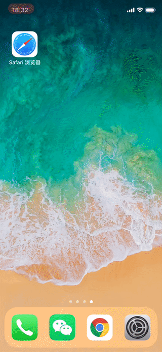

# little-goal

A project to demonstrate `PWA`, `IndexedDB`, `React Hooks`, and it is also a little useful tool.

## Introduction

Tech stacks:
* Material-UI, CSS in JS.
* IndexedDB, [coladb](https://github.com/xwcoder/coladb).
* React: hooks, rematch, react-router.

>There is no test code for time reasons.

>Target device is iOS 12.

Open with Safari, and click `share` -> `Add to Home screen`.

[Online address](https://xwcoder.github.io/little-goal/).




## Development

Development/dev
```bash
npm i
npm run dev:app
npm run dev:sw
```

build
```bash
npm run build
```

Lint
```bash
npm run lint
```
